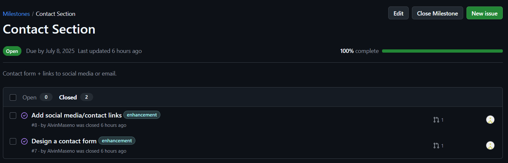
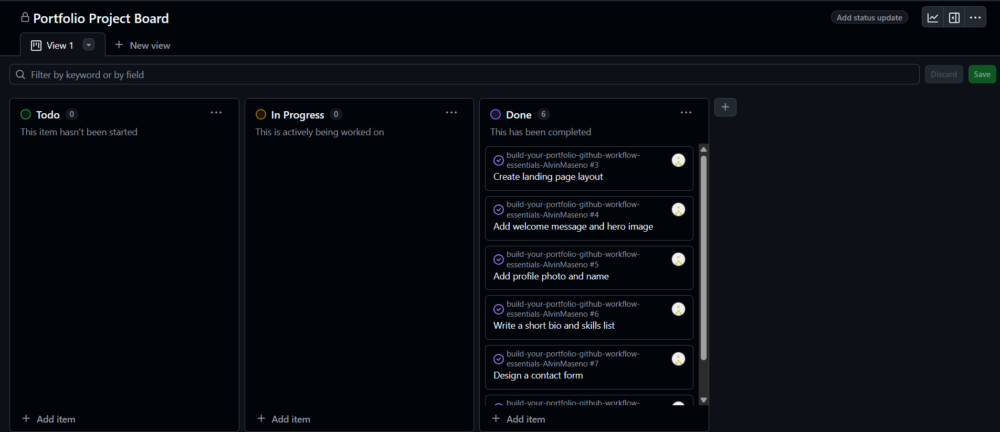
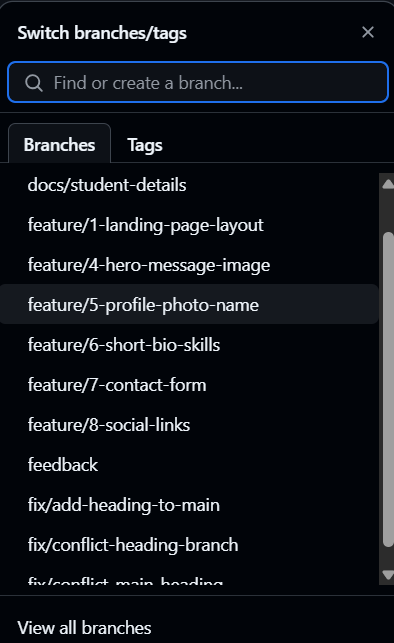
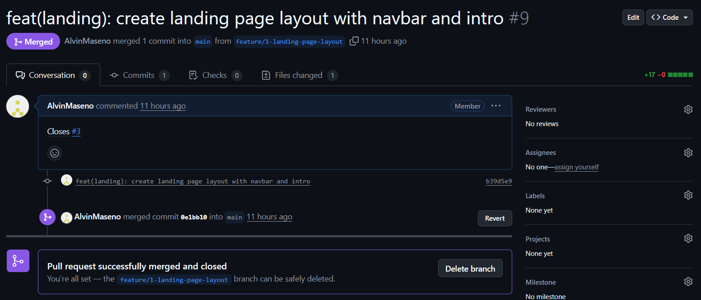
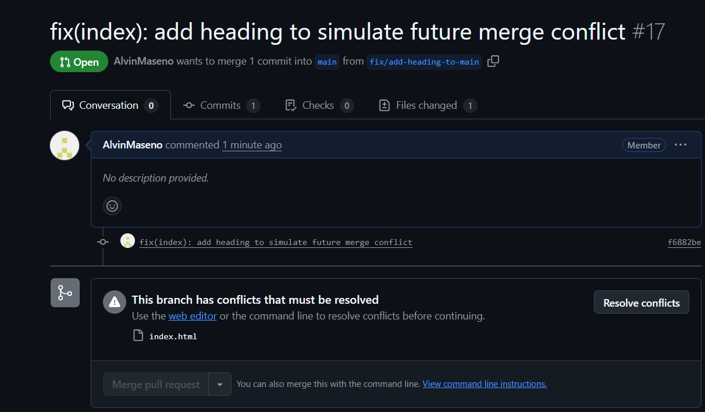
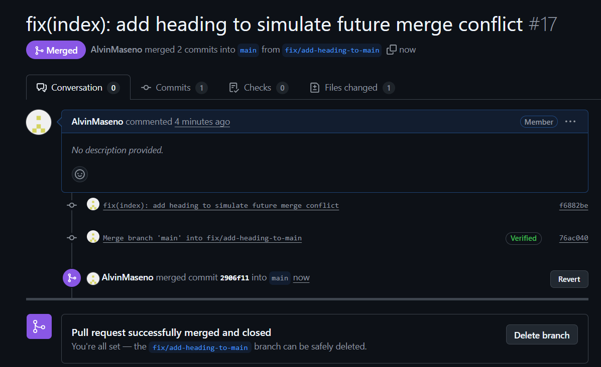

# Personal Portfolio Documentation

## 1. Student Details

- **Full Name**: Maseno Alvin Nyanaro
- **Admission Number**: 150356
- **GitHub Username**: AlvinMaseno
- **Email**: alvin.mase-@strathmore.edu

## 2. Deployed Portfolio Link

- **GitHub Pages URL**:  
  https://is-project-4th-year.github.io/build-your-portfolio-github-workflow-essentials-AlvinMaseno/

## 3. Learnings from the Git Crash Program

**🧠 What I Thought I'd Learn vs What I Actually Learned**

#### 1. Concept: Branching  
**Expectation 👀**: I thought branches were only needed in group projects or large applications.  
**Reality 😅**: I realized branches are super helpful even for personal projects to isolate new features and avoid breaking the main code.  
**Impact 💡**: I used a feature branch for each section like the landing page and contact form, and it helped keep everything organized.

---

#### 2. Concept: Pull Requests  
**Expectation 👀**: I thought PRs were mainly for team code reviews and wouldn’t be useful for me.  
**Reality 😅**: I discovered PRs are perfect for tracking changes, linking them to issues, and making sure features are complete before merging.  
**Impact 💡**: Every branch I created was pushed with a PR linked to its issue, which improved my discipline and commit history.

---

#### 3. Concept: Merge Conflicts  
**Expectation 👀**: I assumed merge conflicts were rare and scary to fix.  
**Reality 😅**: They’re actually common and manageable with the GitHub interface, especially when you understand what changed.  
**Impact 💡**: I simulated a conflict in the heading of my `index.html` and resolved it using the GitHub conflict editor—good confidence boost.

---

#### 4. Concept: GitHub Project Boards  
**Expectation 👀**: I thought boards were just visual fluff with no real use.  
**Reality 😅**: They helped me track my progress with To Do, In Progress, and Done columns and kept all issues visible and actionable.  
**Impact 💡**: I linked every issue to the board, assigned them to milestones, and updated status as I worked—very satisfying to see progress!

---

## 4. Screenshots of Key GitHub Features

### A. Milestones and Issues
  
📸 *Caption: Screenshot showing milestone(s) like “Landing Page” and linked issues.*

---

### B. Project Board
  
📸 *Caption: GitHub Project Board showing tasks in “To Do”, “In Progress”, and “Done” columns.*

---

### C. Branching
  
📸 *Caption: Branch dropdown showing feature branches like `feature/landing-page` and `fix/conflict-branch`.*

---

### D. Pull Requests
  
📸 *Caption: A pull request showing structured commit message and linked issue (e.g., “Closes #3”).*

---

### E. Merge Conflict Resolution
  
📸 *Caption: GitHub showing a merge conflict in `index.html`.*

  
📸 *Caption: GitHub showing a resolved merge conflict in `index.html`.*
